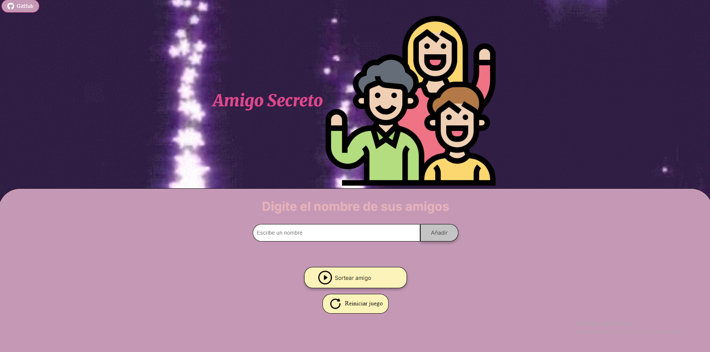

# juego-del-amigo-secreto
## Explicación del juego🕹
Insertar nombres de tus amigos y la maquina elige uno aleatoriamente para sortear.

## Estado del proyecto📍
Finalizado.

## Para poder abrir el archivo📃
Podes clonar el archivo desde Git Clone y abrirlo desde tu navegador o en VSCODE con el LiveServer.
Sino también, ingresar a  cualquiera de estos dos link desde cualquier navegador. Lo que cambia es que uno es de GitHub y el otro de la app Vercel.
https://milagros-coder.github.io/Juego-del-amigo-secreto/
https://juego-del-amigo-secreto-eight.vercel.app

## Explicación de mi proyecto🛠
Hice el código de JavaScript de 0 y cambie algunos detalles del HTML y el CSS con ayuda del chatGPT para algunos puntos como por ejemplo, las alertas distintas a las del navegador.

## Capturas del proyecto🖥
 
